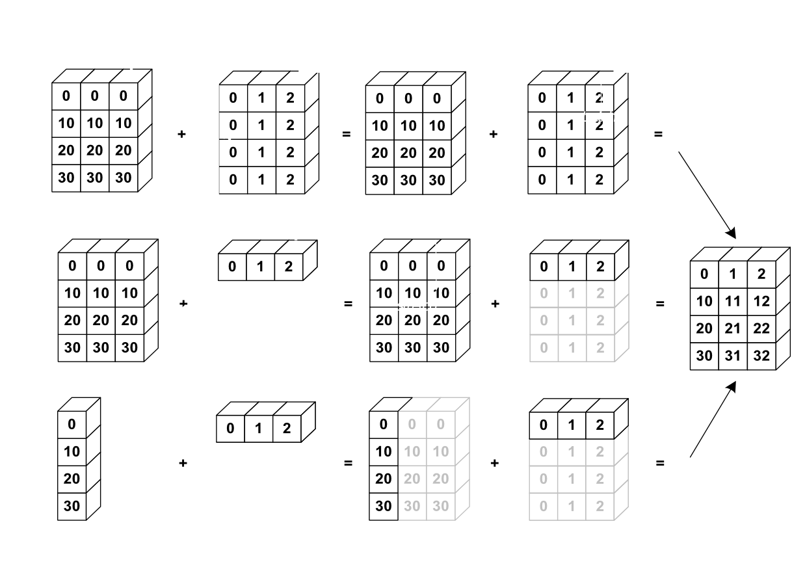

<h1>Table of Contents<span class="tocSkip"></span></h1>
<div class="toc"><ul class="toc-item"><li><span><a href="#Elementwise-Operations" data-toc-modified-id="Elementwise-Operations-1"><span class="toc-item-num">1&nbsp;&nbsp;</span>Elementwise Operations</a></span><ul class="toc-item"><li><span><a href="#Basic-Operations" data-toc-modified-id="Basic-Operations-1.1"><span class="toc-item-num">1.1&nbsp;&nbsp;</span>Basic Operations</a></span><ul class="toc-item"><li><span><a href="#with-scalars" data-toc-modified-id="with-scalars-1.1.1"><span class="toc-item-num">1.1.1&nbsp;&nbsp;</span><strong>with scalars</strong></a></span></li><li><span><a href="#All-arithmetic-operates-elementwise" data-toc-modified-id="All-arithmetic-operates-elementwise-1.1.2"><span class="toc-item-num">1.1.2&nbsp;&nbsp;</span><strong>All arithmetic operates elementwise</strong></a></span></li><li><span><a href="#comparisions" data-toc-modified-id="comparisions-1.1.3"><span class="toc-item-num">1.1.3&nbsp;&nbsp;</span><strong>comparisions</strong></a></span></li></ul></li><li><span><a href="#Logical-Operations" data-toc-modified-id="Logical-Operations-1.2"><span class="toc-item-num">1.2&nbsp;&nbsp;</span><strong>Logical Operations</strong></a></span></li><li><span><a href="#Transcendental-functions:" data-toc-modified-id="Transcendental-functions:-1.3"><span class="toc-item-num">1.3&nbsp;&nbsp;</span><strong>Transcendental functions:</strong></a></span></li><li><span><a href="#Shape-Mismatch" data-toc-modified-id="Shape-Mismatch-1.4"><span class="toc-item-num">1.4&nbsp;&nbsp;</span><strong>Shape Mismatch</strong></a></span></li></ul></li><li><span><a href="#Basic-Reductions" data-toc-modified-id="Basic-Reductions-2"><span class="toc-item-num">2&nbsp;&nbsp;</span>Basic Reductions</a></span><ul class="toc-item"><li><span><a href="#computing-sums" data-toc-modified-id="computing-sums-2.1"><span class="toc-item-num">2.1&nbsp;&nbsp;</span><strong>computing sums</strong></a></span></li><li><span><a href="#Other-reductions" data-toc-modified-id="Other-reductions-2.2"><span class="toc-item-num">2.2&nbsp;&nbsp;</span><strong>Other reductions</strong></a></span></li><li><span><a href="#Logical-Operations" data-toc-modified-id="Logical-Operations-2.3"><span class="toc-item-num">2.3&nbsp;&nbsp;</span><strong>Logical Operations</strong></a></span></li><li><span><a href="#Statistics" data-toc-modified-id="Statistics-2.4"><span class="toc-item-num">2.4&nbsp;&nbsp;</span><strong>Statistics</strong></a></span></li></ul></li><li><span><a href="#Example:" data-toc-modified-id="Example:-3"><span class="toc-item-num">3&nbsp;&nbsp;</span><strong>Example:</strong></a></span></li><li><span><a href="#Broadcasting" data-toc-modified-id="Broadcasting-4"><span class="toc-item-num">4&nbsp;&nbsp;</span>Broadcasting</a></span></li><li><span><a href="#Array-Shape-Manipulation" data-toc-modified-id="Array-Shape-Manipulation-5"><span class="toc-item-num">5&nbsp;&nbsp;</span>Array Shape Manipulation</a></span><ul class="toc-item"><li><span><a href="#Flattening--ravel()" data-toc-modified-id="Flattening--ravel()-5.1"><span class="toc-item-num">5.1&nbsp;&nbsp;</span><strong>Flattening</strong>- ravel()</a></span></li><li><span><a href="#Reshaping" data-toc-modified-id="Reshaping-5.2"><span class="toc-item-num">5.2&nbsp;&nbsp;</span><strong>Reshaping</strong></a></span></li><li><span><a href="#Adding-a-Dimension-np.newaxis" data-toc-modified-id="Adding-a-Dimension-np.newaxis-5.3"><span class="toc-item-num">5.3&nbsp;&nbsp;</span><strong>Adding a Dimension</strong>-np.newaxis</a></span></li><li><span><a href="#Dimension-Shuffling" data-toc-modified-id="Dimension-Shuffling-5.4"><span class="toc-item-num">5.4&nbsp;&nbsp;</span><strong>Dimension Shuffling</strong></a></span></li><li><span><a href="#Resizing" data-toc-modified-id="Resizing-5.5"><span class="toc-item-num">5.5&nbsp;&nbsp;</span><strong>Resizing</strong></a></span></li><li><span><a href="#Sorting-Data---sort(),-argsort()" data-toc-modified-id="Sorting-Data---sort(),-argsort()-5.6"><span class="toc-item-num">5.6&nbsp;&nbsp;</span><strong>Sorting Data</strong>-  sort(), argsort()</a></span></li></ul></li></ul></div>


```python
import numpy as np
```

# Elementwise Operations

## Basic Operations

### **with scalars**


```python
a = np.array([1, 2, 3, 4]) #create an array

a + 1
```


    array([2, 3, 4, 5])


```python
a ** 2
```


    array([ 1,  4,  9, 16], dtype=int32)


### **All arithmetic operates elementwise**


```python
b = np.ones(4) + 1

a - b
```


    array([-1.,  0.,  1.,  2.])


```python
a * b
```


    array([2., 4., 6., 8.])


```python
# Matrix multiplication

c = np.diag([1, 2, 3, 4])

print(c * c)
print("*****************")
print(c.dot(c))
```

    [[ 1  0  0  0]
     [ 0  4  0  0]
     [ 0  0  9  0]
     [ 0  0  0 16]]
    *****************
    [[ 1  0  0  0]
     [ 0  4  0  0]
     [ 0  0  9  0]
     [ 0  0  0 16]]
    

### **comparisions**


```python
a = np.array([1, 2, 3, 4])
b = np.array([5, 2, 2, 4])
a == b
```


    array([False,  True, False,  True])


```python
a > b
```


    array([False, False,  True, False])


```python
#array-wise comparisions
a = np.array([1, 2, 3, 4])
b = np.array([5, 2, 2, 4])
c = np.array([1, 2, 3, 4])

np.array_equal(a, b)
```


    False


```python
np.array_equal(a, c)
```


    True


## **Logical Operations**


```python
a = np.array([1, 1, 0, 0], dtype=bool)
b = np.array([1, 0, 1, 0], dtype=bool)

np.logical_or(a, b)
```


    array([ True,  True,  True, False])


```python
np.logical_and(a, b)
```


    array([ True, False, False, False])


## **Transcendental functions:**


```python
a = np.arange(5)

np.sin(a)   
```


    array([ 0.        ,  0.84147098,  0.90929743,  0.14112001, -0.7568025 ])


```python
np.log(a)
```

    <ipython-input-14-89b6b8e53c58>:1: RuntimeWarning: divide by zero encountered in log
      np.log(a)
    


    array([      -inf, 0.        , 0.69314718, 1.09861229, 1.38629436])


```python
np.exp(a)   #evaluates e^x for each element in a given input
```


    array([ 1.        ,  2.71828183,  7.3890561 , 20.08553692, 54.59815003])


## **Shape Mismatch**


```python
a = np.arange(4)

a + np.array([1, 2])
```


    ---------------------------------------------------------------------------

    ValueError                                Traceback (most recent call last)

    <ipython-input-16-9bed92644e4e> in <module>
          1 a = np.arange(4)
          2 
    ----> 3 a + np.array([1, 2])
    

    ValueError: operands could not be broadcast together with shapes (4,) (2,) 


# Basic Reductions

## **computing sums**


```python
x = np.array([1, 2, 3, 4])
np.sum(x)
```


    10


```python
#sum by rows and by columns

x = np.array([[1, 1], [2, 2]])
x
```


    array([[1, 1],
           [2, 2]])


```python
x.sum(axis=0)   #columns first dimension
```


    array([3, 3])


```python
x.sum(axis=1)  #rows (second dimension)
```


    array([2, 4])


## **Other reductions**


```python
x = np.array([1, 3, 2])
x.min()
```


    1


```python
x.max()
```


    3


```python
x.argmin()# index of minimum element
```


    0


```python
x.argmax()# index of maximum element
```


    1


## **Logical Operations**


```python
np.all([True, True, False])
```


    False


```python
np.any([True, False, False])
```


    True


```python
#Note: can be used for array comparisions
a = np.zeros((50, 50))
np.any(a != 0)
```


    False


```python
np.all(a == a)
```


    True


```python
a = np.array([1, 2, 3, 2])
b = np.array([2, 2, 3, 2])
c = np.array([6, 4, 4, 5])
((a <= b) & (b <= c)).all()
```


    True


## **Statistics**


```python
x = np.array([1, 2, 3, 1])
y = np.array([[1, 2, 3], [5, 6, 1]])
x.mean()
```


    1.75


```python
np.median(x)
```


    1.5


```python
np.median(y, axis=-1) # last axis
```


    array([2., 5.])


```python
x.std()          # full population standard dev.
```


    0.82915619758885


# **Example:**

Data in populations.txt describes the populations of hares and lynxes (and carrots) in northern Canada during 20 years.


```python
#load data into numpy array object
data = np.loadtxt('populations.txt')
```


```python
data
```


    array([[ 1900., 30000.,  4000., 48300.],
           [ 1901., 47200.,  6100., 48200.],
           [ 1902., 70200.,  9800., 41500.],
           [ 1903., 77400., 35200., 38200.],
           [ 1904., 36300., 59400., 40600.],
           [ 1905., 20600., 41700., 39800.],
           [ 1906., 18100., 19000., 38600.],
           [ 1907., 21400., 13000., 42300.],
           [ 1908., 22000.,  8300., 44500.],
           [ 1909., 25400.,  9100., 42100.],
           [ 1910., 27100.,  7400., 46000.],
           [ 1911., 40300.,  8000., 46800.],
           [ 1912., 57000., 12300., 43800.],
           [ 1913., 76600., 19500., 40900.],
           [ 1914., 52300., 45700., 39400.],
           [ 1915., 19500., 51100., 39000.],
           [ 1916., 11200., 29700., 36700.],
           [ 1917.,  7600., 15800., 41800.],
           [ 1918., 14600.,  9700., 43300.],
           [ 1919., 16200., 10100., 41300.],
           [ 1920., 24700.,  8600., 47300.]])


```python
data.T
```


    array([[ 1900.,  1901.,  1902.,  1903.,  1904.,  1905.,  1906.,  1907.,
             1908.,  1909.,  1910.,  1911.,  1912.,  1913.,  1914.,  1915.,
             1916.,  1917.,  1918.,  1919.,  1920.],
           [30000., 47200., 70200., 77400., 36300., 20600., 18100., 21400.,
            22000., 25400., 27100., 40300., 57000., 76600., 52300., 19500.,
            11200.,  7600., 14600., 16200., 24700.],
           [ 4000.,  6100.,  9800., 35200., 59400., 41700., 19000., 13000.,
             8300.,  9100.,  7400.,  8000., 12300., 19500., 45700., 51100.,
            29700., 15800.,  9700., 10100.,  8600.],
           [48300., 48200., 41500., 38200., 40600., 39800., 38600., 42300.,
            44500., 42100., 46000., 46800., 43800., 40900., 39400., 39000.,
            36700., 41800., 43300., 41300., 47300.]])


```python
year, hares, lynxes, carrots = data.T #columns to variables
print(year)
```

    [1900. 1901. 1902. 1903. 1904. 1905. 1906. 1907. 1908. 1909. 1910. 1911.
     1912. 1913. 1914. 1915. 1916. 1917. 1918. 1919. 1920.]
    


```python
print(hares)
```

    [30000. 47200. 70200. 77400. 36300. 20600. 18100. 21400. 22000. 25400.
     27100. 40300. 57000. 76600. 52300. 19500. 11200.  7600. 14600. 16200.
     24700.]
    


```python
#The mean population over time
populations = data[:, 1:]
populations
```


    array([[30000.,  4000., 48300.],
           [47200.,  6100., 48200.],
           [70200.,  9800., 41500.],
           [77400., 35200., 38200.],
           [36300., 59400., 40600.],
           [20600., 41700., 39800.],
           [18100., 19000., 38600.],
           [21400., 13000., 42300.],
           [22000.,  8300., 44500.],
           [25400.,  9100., 42100.],
           [27100.,  7400., 46000.],
           [40300.,  8000., 46800.],
           [57000., 12300., 43800.],
           [76600., 19500., 40900.],
           [52300., 45700., 39400.],
           [19500., 51100., 39000.],
           [11200., 29700., 36700.],
           [ 7600., 15800., 41800.],
           [14600.,  9700., 43300.],
           [16200., 10100., 41300.],
           [24700.,  8600., 47300.]])


```python
#sample standard deviations
populations.std(axis=0)
```


    array([20897.90645809, 16254.59153691,  3322.50622558])


```python
#which species has the highest population each year?

np.argmax(populations, axis=1)
```


    array([2, 2, 0, 0, 1, 1, 2, 2, 2, 2, 2, 2, 0, 0, 0, 1, 2, 2, 2, 2, 2],
          dtype=int64)


# Broadcasting

Basic operations on numpy arrays (addition, etc.) are elementwise

This works on arrays of the same size.
    Nevertheless, It’s also possible to do operations on arrays of different sizes if NumPy can transform these arrays     so that they all have the same size: this conversion is called broadcasting.

The image below gives an example of broadcasting:




```python
a = np.tile(np.arange(0, 40, 10), (3,1))
print(a)

print("*************")
a=a.T
print(a)
```

    [[ 0 10 20 30]
     [ 0 10 20 30]
     [ 0 10 20 30]]
    *************
    [[ 0  0  0]
     [10 10 10]
     [20 20 20]
     [30 30 30]]
    


```python

b = np.array([0, 1, 2])
b
```


    array([0, 1, 2])


```python

a + b
```


    array([[ 0,  1,  2],
           [10, 11, 12],
           [20, 21, 22],
           [30, 31, 32]])


```python
a = np.arange(0, 40, 10)
a.shape

```


    (4,)


```python
a
```


    array([ 0, 10, 20, 30])


```python
a = a[:, np.newaxis]  # adds a new axis -> 2D array
a.shape
```


    (4, 1)


```python
a
```


    array([[ 0],
           [10],
           [20],
           [30]])


```python
a + b
```


    array([[ 0,  1,  2],
           [10, 11, 12],
           [20, 21, 22],
           [30, 31, 32]])


# Array Shape Manipulation

## **Flattening**- ravel()


```python
a = np.array([[1, 2, 3], [4, 5, 6]])
a.ravel()        #Return a contiguous flattened array. A 1-D array, 
                #containing the elements of the input, is returned. A copy is made only if needed.
```


    array([1, 2, 3, 4, 5, 6])


```python
a.T #Transpose
```


    array([[1, 4],
           [2, 5],
           [3, 6]])


```python
a.T.ravel()
```


    array([1, 4, 2, 5, 3, 6])


## **Reshaping**

The inverse operation to flattening:


```python
print(a.shape)
print(a)
```

    (2, 3)
    [[1 2 3]
     [4 5 6]]
    


```python
b = a.ravel()
print(b)
```

    [1 2 3 4 5 6]
    


```python
b = b.reshape((2, 3))
b
```


    array([[1, 2, 3],
           [4, 5, 6]])


```python
b[0, 0] = 100
a
```


    array([[100,   2,   3],
           [  4,   5,   6]])


 **Note and       Beware: reshape may also return a copy!:**


```python
a = np.zeros((3, 2))
b = a.T.reshape(3*2)
b[0] = 50
a
```


    array([[0., 0.],
           [0., 0.],
           [0., 0.]])


## **Adding a Dimension**-np.newaxis

Indexing with the np.newaxis object allows us to add an axis to an array

newaxis is used to increase the dimension of the existing array by one more dimension, when used once. Thus,

1D array will become 2D array

2D array will become 3D array

3D array will become 4D array and so on


```python
z = np.array([1, 2, 3])
z
```


    array([1, 2, 3])


```python
z[:, np.newaxis]
```


    array([[1],
           [2],
           [3]])


## **Dimension Shuffling**


```python
a = np.arange(4*3*2).reshape(4, 3, 2)
a.shape
```


    (4, 3, 2)


```python
a
```


    array([[[ 0,  1],
            [ 2,  3],
            [ 4,  5]],
    
           [[ 6,  7],
            [ 8,  9],
            [10, 11]],
    
           [[12, 13],
            [14, 15],
            [16, 17]],
    
           [[18, 19],
            [20, 21],
            [22, 23]]])


```python
a[0, 2, 1]
```


    5


## **Resizing**


```python
a = np.arange(4)
a.resize((8,))
a
```


    array([0, 1, 2, 3, 0, 0, 0, 0])


However, it must not be referred to somewhere else:


```python
b = a
a.resize((4,)) 
```


    ---------------------------------------------------------------------------

    ValueError                                Traceback (most recent call last)

    <ipython-input-64-5d858401815e> in <module>
          1 b = a
    ----> 2 a.resize((4,))
    

    ValueError: cannot resize an array that references or is referenced
    by another array in this way.
    Use the np.resize function or refcheck=False


```python
#Sorting along an axis:
a = np.array([[5, 4, 6], [2, 3, 2]])
b = np.sort(a, axis=1)
b
```


    array([[4, 5, 6],
           [2, 2, 3]])


## **Sorting Data**-  sort(), argsort()


```python
#in-place sort
a = np.array([[5, 4, 6], [2, 3, 2]])
a.sort(axis=1)
a
```


    array([[4, 5, 6],
           [2, 2, 3]])


```python
a.sort(axis=0)
a
```


    array([[2, 2, 3],
           [4, 5, 6]])


```python
#sorting with fancy indexing
a = np.array([4, 3, 1, 2])
j = np.argsort(a)
j
```


    array([2, 3, 1, 0], dtype=int64)


```python
a[j]
```


    array([1, 2, 3, 4])


---
